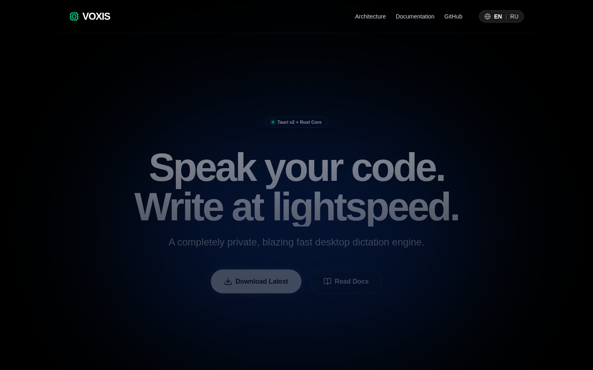
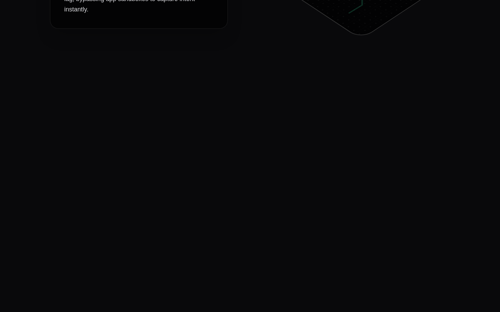

<div align="center">
  
  <br/><br/>
</div>

# Voxis (formerly SoupaWhisper / TALRI)

A blazing fast, completely private desktop voice dictation engine built with **Tauri v2**, **React 18**, and **Rust**.

<div align="center">
  
  <br/>
  <em>Zero-lag native hotkeys, Rust CPAL audio core, and Whisper LPU inference.</em>
</div>

## Tech Stack

- **Frontend**: React 18 + TypeScript + Vite
- **Backend**: Rust + Tauri v2
- **Testing**: Vitest + Cargo test + Playwright E2E
- **License**: MIT

## Documentation

Published docs: <https://axelbaumlisto.github.io/voice/>

- [Installation](https://axelbaumlisto.github.io/voice/installation.html)
- [Usage](https://axelbaumlisto.github.io/voice/usage.html)
- [Settings](https://axelbaumlisto.github.io/voice/settings.html)
- [Themes](https://axelbaumlisto.github.io/voice/themes.html)
- [Security](https://axelbaumlisto.github.io/voice/security.html)
- [Troubleshooting](https://axelbaumlisto.github.io/voice/troubleshooting.html)

`CLAUDE.md` is optional contributor guidance for AI coding assistants; normal user and developer documentation starts with this README and the published docs above.

## Development

```bash
# Install dependencies
bun install

# Run development server with Tauri
bun run tauri dev

# Run checks
bun run test:run                  # Frontend tests
cd src-tauri && cargo test        # Rust tests
bun run test:e2e                  # Playwright E2E
bun run lint                      # ESLint
```

## Configuration and credentials

SoupaWhisper uses cloud transcription by default. For the default Groq endpoint,
create a key in the [Groq Console](https://console.groq.com/) and paste the raw
key into **Settings → Provider → API Key**. Groq keys usually look like
`gsk_...`; paste only the key, without `Bearer`, quotes, or extra spaces. Check
current access limits/pricing in the Groq Console.

The default transcription model is `whisper-large-v3`; Settings also offers
`whisper-large-v3-turbo`. The Provider dropdown stores Groq/OpenAI labels, but
the current transcription path uses the default Groq-compatible endpoint unless
`api_url_override` is set by tests or a custom build. OpenAI keys often start
with `sk-...`; that is only an OpenAI credential example, not the expected key
for default Groq transcription. Optional LLM post-processing has separate
provider/model/API-key settings.

SoupaWhisper stores API keys as **local runtime configuration** and must not
commit them to git. Configure the transcription API key and optional LLM key
through the app settings UI; the application does not automatically load
credentials from environment variables.

Do not commit `config.db`, `history.db`, `dictionary.txt`, `corrections.db`,
`providers.db`, `prompts.db`, user `themes/`, `failed_audio/`, `debug/`, `logs/`,
`.env*`, or local agent scratch files. See [SECURITY.md](SECURITY.md).

## Build

```bash
bun run tauri build
```

## Features

- Voice recording with hotkey trigger and optional overlay click/press control
- Transcription through the app's Whisper-compatible client (default Groq endpoint)
- Optional LLM post-processing
- Settings management
- Transcription history and retry handling for failed audio
- Dictionary replacements and learning suggestions
- User-editable recording overlay themes
- System tray integration

## Custom Themes

The recording overlay supports user-written themes — self-contained ES modules
that render into the overlay webview. Each theme is a folder in your config's
`themes/` directory with a manifest v2 (`theme.json`) and a `theme.js` entry
point. Themes can declare their own `overlay_width` / `overlay_height`; otherwise
the default overlay size is used. Copy a builtin theme folder as a starting
point, edit the code, then use Reload + Preview or reload/reselect it in
Settings. See the full guide at **[docs/THEMES.md](docs/THEMES.md)**.

## License

MIT. See [LICENSE](LICENSE).
