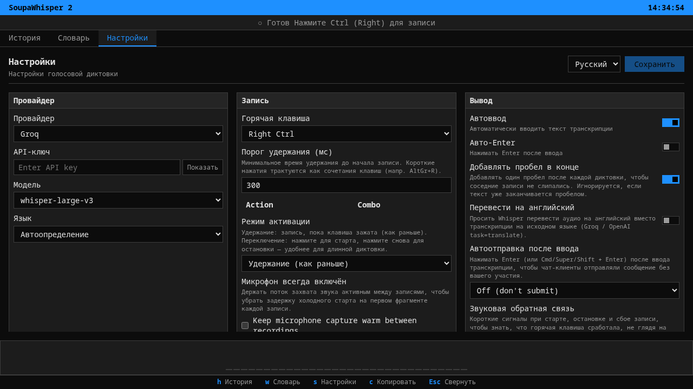

# Settings

Settings are edited in the app and stored locally under the platform config directory. The Settings page is generated from `src/lib/settingsRegistry.ts`; dictionary learning controls also appear on the Dictionary page.

_Settings page with provider and recording controls._

## Provider

- Provider (`cloud_provider`): Groq or OpenAI in the UI. This label is stored in config and debug metadata, but the current transcription client does not route by it; it uses the default Groq-compatible transcription URL unless `api_url_override` is set by tests or a custom build.
- API Key (`api_key`): password field stored locally. For default Groq transcription, paste the raw `gsk_...` key only — no `Bearer ` prefix, no quotes, no extra spaces. Groq keys are created in the [Groq Console](https://console.groq.com/). OpenAI keys commonly look like `sk-...`, but that is only an OpenAI credential-format example, not the expected key for default Groq transcription.
- Model (`model`): default `whisper-large-v3`; the other UI choice is `whisper-large-v3-turbo`.
- Language (`language`): auto-detect plus Russian, English, German, French, Spanish, Chinese, Japanese, Korean, Portuguese, Italian, Dutch, Polish, and Ukrainian.

## Recording

- Hotkey (`hotkey`): Right/Left Ctrl, Right/Left Alt, platform Super/Cmd/Win keys, or F8-F12 in the UI. Rust validation also accepts additional single keys and modifier combos.
- Hold threshold (`hotkey_hold_ms`): default 300 ms.
- Shortcut bindings (`shortcut_bindings`): custom multi-binding editor.
- Activation mode (`hotkey_mode`): hold or toggle.
- Always-on microphone (`always_on_microphone`): stored in config; macOS already keeps the stream warm, Linux/Windows wiring is not implemented yet.
- Audio Device (`audio_device`): `Default` or a listed device from `list_audio_devices`.

## Output

- Auto-type (`auto_type`): enabled by default. When enabled, text is typed directly; on supported platforms a failed auto-type can fall back to clipboard paste.
- Clipboard paste mode: when auto-type is disabled, the app saves the clipboard, copies/pastes the transcription with configured paste shortcuts, and then attempts to restore the previous clipboard.
- Auto-enter (`auto_enter`), append trailing space (`append_trailing_space`), translate to English (`translate_to_english`), auto-submit key, audio feedback, typing delay, notifications, and paste shortcuts.
- Paste shortcut choices are `Ctrl+Shift+V`, `Ctrl+V`, and `Shift+Insert`.

## Overlay

- Enabled (`overlay.enabled`).
- Position: bottom-left, bottom-right, bottom-center, top-left, top-right, top-center, center, left-center, or right-center.
- Size (`overlay.size`): small, medium, or large is still stored for compatibility, but the current webview overlay uses its standard window size unless the selected theme declares valid `overlay_width` and `overlay_height` in its manifest.
- Margin, audio sensitivity/boost, theme, and backend.
- Backend is a custom on/off control: on maps to the cross-platform webview backend and off maps to `none`. Legacy backend strings still fall back in Rust but are not UI choices.

## VAD

VAD settings include backend (`none`, `threshold`, or `silero`), onset frames, hangover frames, and prefill frames. Rust defaults are enabled = true, backend = `none`, threshold = `0.5`, onset = `3`, hangover = `5`, and prefill = `2`.

## LLM

LLM settings are separate from transcription settings. They include enable/disable, LLM provider/model selection, a separate LLM API key field, and prompt templates. Defaults are disabled with Groq provider, model `llama-3.3-70b-versatile`, Groq chat-completions URL, and an empty LLM API key. Builtin LLM provider definitions include Groq (`llama-3.3-70b-versatile`, `llama-3.1-8b-instant`, `mixtral-8x7b-32768`), OpenAI (`gpt-4o`, `gpt-4o-mini`, `gpt-4-turbo`, `gpt-3.5-turbo`), and OpenRouter (`anthropic/claude-3.5-sonnet`, `google/gemini-pro-1.5`, `meta-llama/llama-3.1-70b-instruct`); custom provider definitions are stored locally in `providers.db`.

## Dictionary learning

Dictionary entries and learning controls are on the Dictionary page. Learning modes are disabled, pending/manual, or auto. The default learning mode is `auto` and the default learning threshold is `3`.

## History and advanced

History settings include retention policy (`never`, `preserve_limit`, `days_3`, `weeks_2`, `months_3`) and preserve-limit count. Advanced settings include text processing, debug mode, and display backend (`auto`, `x11`, `wayland`, `darwin`, `windows`).
