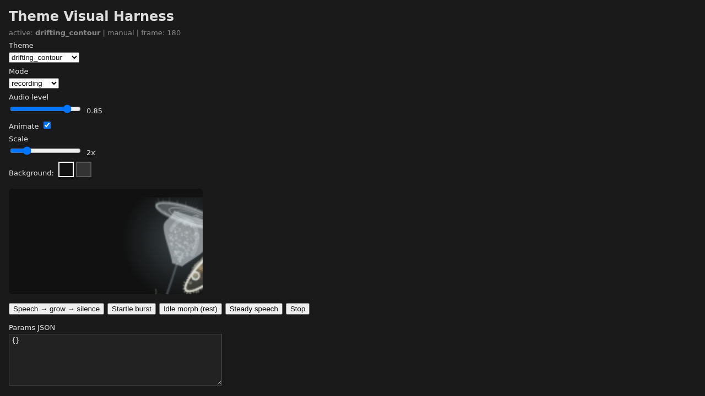

# Themes

Voxis overlay themes are folders containing a `theme.json` manifest and a self-contained `theme.js` ES module. They are loaded from disk at runtime by the overlay webview.

> **Security:** `theme.js` is executable JavaScript trusted by the app. Do not install themes from untrusted sources, and review third-party theme code before using it.



_Theme visual harness showing Drifting Contour in recording mode._

User themes live in the app config directory under `themes/`:

- Linux: `~/.config/voxis/themes/`
- macOS: `~/Library/Application Support/voxis/themes/`
- Windows: `%APPDATA%/voxis/themes/`

## User workflow

1. Copy an existing theme folder from the user themes directory, or copy a bundled output from `src-tauri/themes/<id>/` in a source checkout.
2. Rename the copied folder to the new theme id.
3. Edit `theme.json` and `theme.js`.
4. In Settings, select the theme and use Preview or Reload + Preview; restarting or reselecting the theme also reloads it.

The current Settings UI has theme selection plus preview/reload actions. It does not expose an Export button even though a developer command wrapper exists.

## Contract

A theme exports `mount(container, api)` and returns an object with `unmount()`. The Theme API version is `1` and provides `apiVersion`, manifest `params`, logical `size`, `onState(cb)`, and `actions.cancel()`.

Theme state is:

```ts
{
  mode: "idle" | "recording" | "transcribing" | "error",
  audioLevel: number,
  spectrumBins: number[]
}
```

Manifests use `manifest_version: 2`, `api_version: 1`, an `entry` filename such as `theme.js`, and can optionally declare `overlay_width` and `overlay_height`. Both dimensions must be present and within 16..=4096 logical pixels to be used by the webview overlay; otherwise the standard overlay window size is **172×36** logical pixels (`ThemeHost` / webview defaults).

Theme ids and entry filenames must be safe path components: no empty value, `/`, `\\`, `..`, `.`, or `:`. When scanning themes, the folder name is the authoritative id if it differs from the manifest id.

## Builtin themes and seeding

Builtin theme sources live under `src/theme-engine/builtin/` and are bundled to `src-tauri/themes/` with:

```bash
bun run build:themes
```

The app seeds bundled themes into the user themes directory at startup. Missing bundled themes are copied; existing user copies of bundled themes that are legacy/non-v2 are overwritten with the bundled v2 version; existing manifest-v2 user themes are preserved, even if temporarily invalid. Arbitrary custom invalid/non-v2 theme folders are skipped by the scanner rather than migrated. If edits do not appear, copy the updated `theme.js` and `theme.json` into the user theme directory and reload/reselect the theme.

Builtin themes currently bundled by `bun run build:themes` are: `default`, `winamp_classic`, `neon`, `handy_pill`, `metaballs`, `metaballs25d`, `metaballs3d`, `lavalamp`, `living_reed`, `quiet_reed`, `radiolarian`, `paramecium_solo`, `vorticella_bloom`, `drifting_contour`, `didinium_drift`, `euglena_drift`, `duo_aquarium`, and `all_aquarium`.

## Author references

- [Theme Author Guide](theme-author-guide.md)
- [Theme Editing Workflow](theme-editing.md)
- [Living Cell Motion Notes](cell-math.md)
