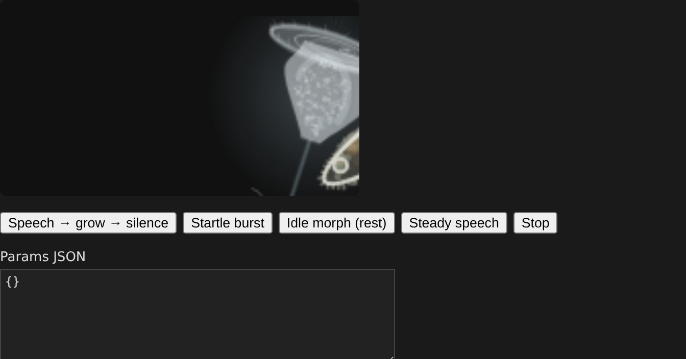
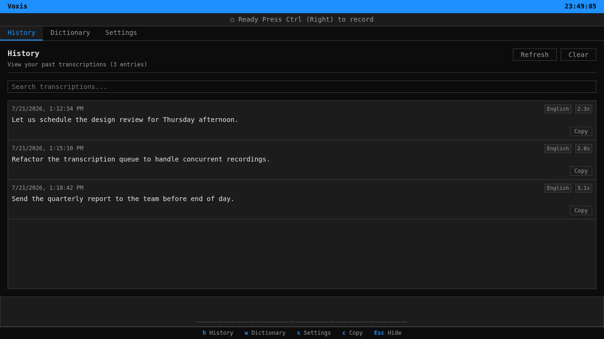
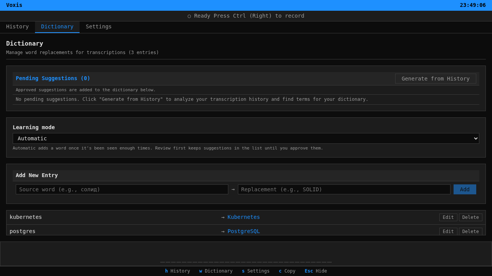

# Usage

## Recording flow

1. Press the configured hotkey. The default is Right Ctrl (`ctrl_r`) with a 300 ms hold threshold.
2. Voxis starts recording from the selected audio input device (`Default` unless changed).
3. In hold mode, release the hotkey to stop. In toggle mode, tap once to start and tap again to stop.
4. The captured audio is filtered by VAD if a VAD backend is selected, then queued for transcription.
5. Recordings shorter than the minimum captured-audio duration are dropped before calling the API. The current default is 300 ms after VAD.
6. The app applies dictionary replacements, hallucination filtering for known no-speech phrases, optional translation-to-English request handling, optional LLM post-processing, and output formatting.
7. The final text is auto-typed when auto-type is enabled. Otherwise the app uses clipboard copy/paste with the configured paste shortcuts and attempts to restore the previous clipboard.

The overlay mirrors idle, recording, transcribing, and error states. It also supports press/release dictation on opaque canvas pixels, so transparent areas of larger aquarium-style themes do not start recording.

_Drifting Contour overlay theme in recording mode._

## Pages and shortcuts

The main app pages are History (`/` and `/history`), Dictionary (`/dictionary`), and Settings (`/settings`). The first-run flow uses `/onboarding`.

Layout shortcuts are `h` for History, `w` for Dictionary, `s` for Settings, `c` to copy the last transcription, and `Esc` to hide the window. The shortcut handler ignores key presses while typing in inputs or text areas.

## History, dictionary, and failed audio

Transcription history defaults to enabled in config (`history_enabled`, not exposed as a Settings toggle). Saved entries go to local `history.db`. History retention is controlled in Settings (`retention_period` / `retention_limit`). Failed transcriptions are stored in `failed_audio/` with WAV audio and JSON metadata; the storage keeps up to three entries (FIFO) and the History page can retry or dismiss them.

_History page with mock transcription entries._

Dictionary entries replace recognized text with preferred spelling or terms. Learning suggestions can be disabled, kept pending for manual approval, or applied automatically depending on dictionary settings.

_Dictionary page with mock replacement entries._

## Runtime data locations

Runtime data is stored under the platform config directory in a `voxis` folder, for example `~/.config/voxis/` on Linux. Important files/directories include `config.db`, `history.db`, `dictionary.txt`, `corrections.db`, `providers.db`, `prompts.db`, `failed_audio/`, `debug/`, `logs/`, and `themes/`.
